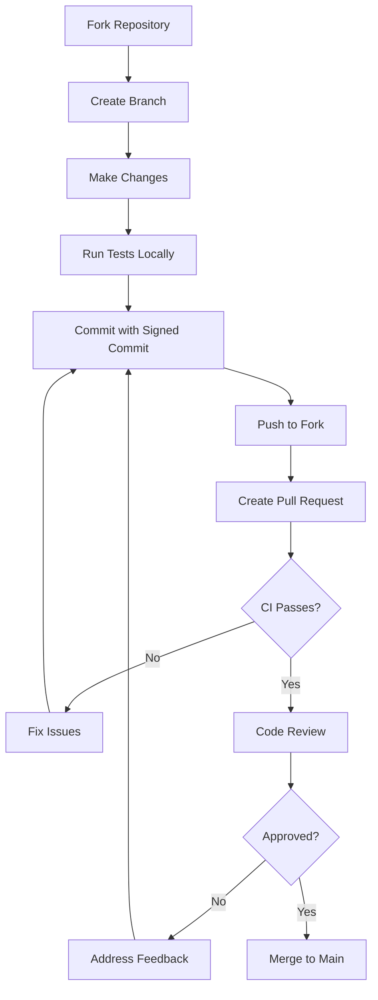

# Branch Protection Rules

This document describes the branch protection rules configured for this repository.

## 🌿 Protected Branches

### `main` Branch

The `main` branch is protected with the following rules:

| Rule                          | Setting      | Reason                           |
| ----------------------------- | ------------ | -------------------------------- |
| Require PR before merging     | ✅ Enabled   | No direct pushes to main         |
| Require approvals             | ✅ 1 approval | Code review required             |
| Dismiss stale reviews         | ✅ Enabled   | New commits dismiss approvals    |
| Require status checks         | ✅ Enabled   | CI must pass                     |
| Require branches up-to-date   | ✅ Enabled   | Merge with latest main           |
| Require signed commits        | ✅ Enabled   | Verify commit authenticity       |
| Require linear history        | ✅ Enabled   | Clean commit history             |
| Include administrators        | ✅ Enabled   | Admins follow same rules         |
| Allow force pushes            | ❌ Disabled  | Prevent history rewriting        |
| Allow deletions               | ❌ Disabled  | Prevent branch deletion          |

### Required Status Checks

The following status checks must pass before merging:

| Check                        | Workflow     | Required |
| ---------------------------- | ------------ | -------- |
| Lint                         | CI           | ✅        |
| Test (unit)                  | CI           | ✅        |
| Security Scan                | Security     | ✅        |
| Docker Build                 | CI           | ✅        |
| Model Validation             | CI           | ⚠️ Warning |

### Recommended (Non-Blocking)

| Check                        | Workflow     | Notes    |
| ---------------------------- | ------------ | -------- |
| Test (integration)           | CI           | May need services |
| Coverage                     | CI           | Target >80% |

## 🔧 GitHub Settings Configuration

To configure these rules in GitHub:

1. Navigate to **Settings** → **Branches**
2. Click **Add branch protection rule**
3. Enter `main` as the branch name pattern
4. Configure the following:

### Basic Settings

```yaml
Branch name pattern: main

Protect matching branches:
  ☑️ Require a pull request before merging
    ☑️ Require approvals: 1
    ☑️ Dismiss stale pull request approvals when new commits are pushed
    ☑️ Require review from Code Owners
    
  ☑️ Require status checks to pass before merging
    ☑️ Require branches to be up to date before merging
    Status checks:
      - Lint
      - Test (unit)
      - Security Scan
      - Docker Build
      
  ☑️ Require conversation resolution before merging
  
  ☑️ Require signed commits
  
  ☑️ Require linear history
  
  ☑️ Include administrators
  
  ☐ Allow force pushes
  
  ☐ Allow deletions
```

### Rulesets (GitHub Enterprise)

For organizations with GitHub Enterprise, use Rulesets for more control:

```yaml
ruleset:
  name: "Main Branch Protection"
  target: branch
  enforcement: active
  conditions:
    ref_name:
      include:
        - "refs/heads/main"
      exclude: []
  rules:
    - type: pull_request
      parameters:
        required_approving_review_count: 1
        dismiss_stale_reviews_on_push: true
        require_code_owner_review: true
        require_last_push_approval: false
        
    - type: required_status_checks
      parameters:
        required_status_checks:
          - context: "Lint"
          - context: "Test (unit)"
          - context: "Security Scan"
          - context: "Docker Build"
        strict_required_status_checks_policy: true
        
    - type: commit_message_pattern
      parameters:
        pattern: "^(feat|fix|docs|style|refactor|test|chore|perf|ci|build|revert)(\\(.+\\))?!?: .+"
        operator: "starts_with"
        
    - type: non_fast_forward
        
    - type: deletion
```

## 👥 CODEOWNERS Integration

The [CODEOWNERS](/.github/CODEOWNERS) file defines required reviewers:

| Path                           | Required Reviewer |
| ------------------------------ | ----------------- |
| `*`                            | @Jacob-Valor      |
| `SECURITY.md`                  | @Jacob-Valor      |
| `.github/workflows/*`          | @Jacob-Valor      |
| `src/preprocessing/compliance_gate.py` | @Jacob-Valor |
| `src/utils/circuit_breaker.py` | @Jacob-Valor      |
| `src/models/*`                 | @Jacob-Valor      |
| `deploy/*`                     | @Jacob-Valor      |

## 🔐 Secret Scanning & Push Protection

GitHub Advanced Security features enabled:

| Feature              | Status   |
| -------------------- | -------- |
| Secret scanning      | ✅ Enabled |
| Push protection      | ✅ Enabled |
| Dependency review    | ✅ Enabled |
| Code scanning (CodeQL) | ✅ Enabled |

## 📋 Workflow for Contributors



## 🚨 Emergency Procedures

### Hotfix Process

For critical production fixes:

1. Create branch from `main`: `git checkout -b hotfix/critical-fix`
2. Make minimal fix
3. Create PR with label `hotfix`
4. Get expedited review
5. Merge with `Squash and merge`

### Bypassing Branch Protection (Admin Only)

In emergencies, administrators can:

1. Go to **Settings** → **Branches**
2. Temporarily disable specific rules
3. Complete emergency fix
4. **Immediately re-enable protection**
5. Document the bypass in incident report

## 📊 Compliance

This branch protection configuration supports:

| Framework   | Requirement Met                    |
| ----------- | ---------------------------------- |
| SOC 2       | Code review controls               |
| PCI-DSS     | Secure development practices       |
| ISO 27001   | Change management controls         |
| NIST CSF    | Protective technology (PR.PT-1)    |
